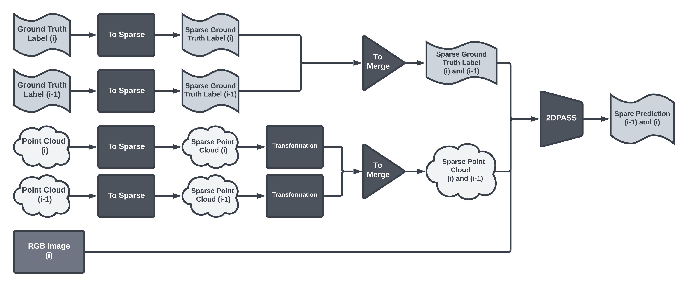
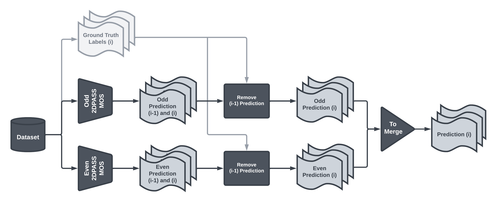

# 2DPASS-MOS

2DPASS-MOS is a Moving Object Segmentation (MOS) network based on [2DPASS](https://github.com/yanx27/2DPASS). 
It operates on 3D LiDAR point clouds, but instead of semantic segmentation, the network decomposes the scene into static and dynamic objects using data fusion.
The network takes advantage of 2D images during training, such as dense color information and fine grained texture, to provide additional information to the point cloud. 
After the traning, the network performs segmentation on the clean LiDAR point clouds, whithout using the images directly.

Using just one scan achieves remarkable results, but this network also provides the possibility to use multiple (sparse) LiDAR point clouds in both training and prediction to extract additional moving information. 
To create the multi-scan version of the model, the solution provided by the [4DMOS](https://github.com/PRBonn/4DMOS) was a great help during the implementation.

We want to thank the original authors for their clear implementation and great work, which has greatly helped our project.


## How it works

In case of one scan, it works the same as 2DPASS, but instead of semantic segmentation, the network performs moving object segmentation.
However, in the case of multiple scans, several internal structural changes were made.

The network first performs a sparse operation, taking only the odd (or even) points of the point cloud.
After that the network transforms the point clouds into a common point based on the current scan, and finally performs a merge.

<p align="center">
    
</p>

The output of the network in this form does not match the expectations of the SemanticKITTI Banchmarks, so it requires post-processing to evaluate the results.
Predictions must be evaluated for both even and odd sparse models, and then the results of these models must be combined.
The first step is to select only the points of the current scan, and then merge the even and odd results.

<p align="center">
    
</p>


## Installation

- Download the original [2DPASS](https://github.com/yanx27/2DPASS) then modify it as described in the adaptation section.
- The dependencies will be the same as for the original [2DPASS](https://github.com/yanx27/2DPASS#requirements).
- The models were run on the [SemanticKITTI](http://www.semantic-kitti.org/index.html) dataset. 

### Data Preparation

As with 2DPASS, you need to download the files from the [SemanticKITTI website](http://semantic-kitti.org/dataset.html) and the color data from the [Kitti Odometry website](http://www.cvlibs.net/datasets/kitti/eval_odometry.php) and extract them into a folder.

```
./dataset/
├── ...
└── SemanticKitti/
    ├── ...
    └── dataset/
        ├── ...
        └── sequences/
            ├── 00/ # 00-10 for traning       
            │   ├── velodyne/	
            |   |	├── 000000.bin
            |   |	├── 000001.bin
            |   |	└── ...
            │   └── labels/ 
            |   |   ├── 000000.label
            |   |   ├── 000001.label
            |   |   └── ...
            |   └── image_2/ 
            |   |   ├── 000000.png
            |   |   ├── 000001.png
            |   |   └── ...
            |   calib.txt
            |   poses.txt
            ├── 08/ # for validation
            ├── 11/ # 11-21 for testing
            └── 21/
```


### MOS adaptation

- The first step is to set the label mapping correctly, using the file provided by [LMNet](https://github.com/PRBonn/LiDAR-MOS). To do this, insert the file "semantic-kitti-mos.yaml", which can be found in the "adaptation" folder, into the "config/label_mapping" folder within the 2DPASS file structure. 
- The next step is to specify the path for the new label_mapping config file and set the number of classes and the number of points within the classes. To do this, paste the file "adaptation/2DPASS-semantickitti-mos.yaml" into the 2DPASS "config" folder.

```
./config/
├── ...
├── 2DPASS-semantickitti-mos.yaml
└── label_mapping/
    ├── ...
    └── semantic-kitti-mos.yaml
```

## Training

To train a 2DPASS-MOS network, you can run the training with:

```shell script
python main.py --log_dir 2DPASS-MOS_semkitti --config config/2DPASS-semantickitti-mos.yaml --gpu 0
```

- log_dir: The output path
- config: The config file path
- gpu: The index of the GPU to use for traning


## Testing

IMPORTANT: Currently, testing is not working well in case of MOS. It doesn't print the result, but it can be used to extract it and then evaluate it by another method.

TIPP: Change the split of the dataset in the "./config/label_mapping/semantic-kitti-mos.yaml" file to To specify the sequences you want to save.

TIPP: The test can also be run on a pre-trained model, which can be found in this [link](https://drive.google.com/file/d/1VhlFOA7pM5ue0rWLJ4DXhIEYtkvBT4zK).

To test a 2DPASS-MOS network, you can run the test with:

```shell script
python main.py --config config/2DPASS-semantickitti-mos.yaml --gpu 0 --test --submit_to_server --num_vote 12 --checkpoint <checkpoint path>
```

- config: The config file path
- gpu: The index of the GPU to use for testing
- test: This indicates that testing will be done
- submit_to_srever: This indicates that the result will be saved
- num_vote: Number of views for the test-time-augmentation. (For more information, visit the [2DPASS](https://github.com/yanx27/2DPASS#testing) website)
- checkpoint: The path of the model on which the test will run.

## Evaluation and visualization

To visualize and evaluate the results, we used the solution of [LMNet](https://github.com/PRBonn/LiDAR-MOS/tree/main#evaluation-and-visualization).
On this repository you can find everything you need to analyse the results nicely and clearly documented.

## Try 2 Frame version (Beta)
- ToDo: Describe 2F version

## Results

You can find the models with the scores below from this [link](https://drive.google.com/file/d/1VhlFOA7pM5ue0rWLJ4DXhIEYtkvBT4zK).

|Model (validation)|mIoU|mIoU (TTA)|
|:---:|:---:|:---:|
|LMNet R1|60.5%| - |
|LMNet R8|67.1%| - |
|2DPASS-MOS 1F|58.5%|65.6%|
|2DPASS-MOS 2F|67.6%| - |

- R: Residual number (Residual 1 is use 2 Frame)
- F: Frame number

## License
This repository is released under HUN-REN SZTAKI License (see LICENSE file for details).
