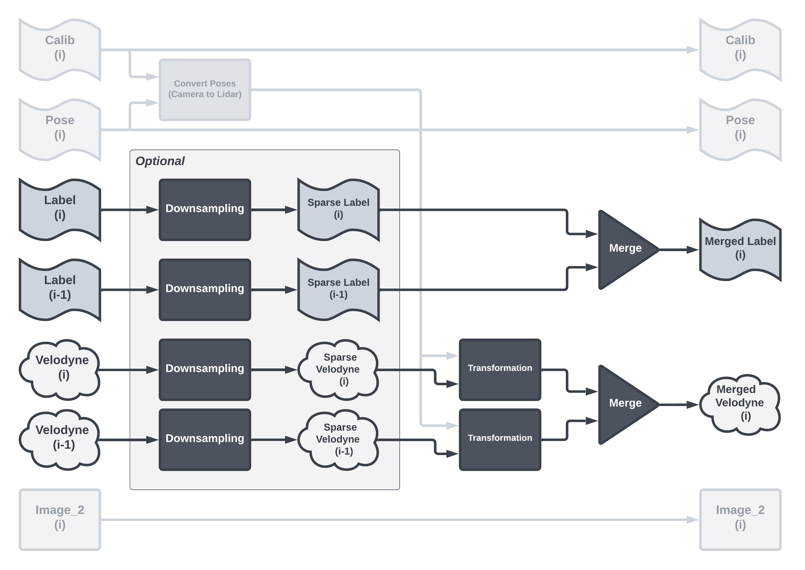

# 2DPASS-MOS

2DPASS-MOS is a Moving Object Segmentation (MOS) method based on [2DPASS](https://github.com/yanx27/2DPASS). 
It operates on 3D LiDAR point clouds, but instead of semantic segmentation, this method decomposes the scene into static and dynamic objects using data fusion.
The network takes advantage of the features of 2D images during training, such as dense color information and fine-grained texture, to provide additional information to the LiDAR scans. 
During inference, the network performs segmentation on the clean LiDAR point clouds, without using the images directly.

Using just one scan already achieves remarkable results, but this method provides the possibility to use multiple (sparse) LiDAR point clouds for both training and inference to extract additional moving information. 
To create the multi-scan version of the network, the solution provided by the [4DMOS](https://github.com/PRBonn/4DMOS) was a great help during the implementation.

We want to thank the original authors for their clear implementation and great work, which has greatly helped our project.

<p align="left">
    
</p>


## How it works

In case of one scan, it works the same as 2DPASS, but instead of semantic segmentation, this method performs moving object segmentation.
However, in the case of multiple scans, several internal structural changes were made.

The network first performs a sparse operation, taking only the odd (or even) points of the point cloud.
After that, the network transforms the point clouds into a common point based on the current scan, then finally performs a merge.

<p align="center">
    
</p>

The output of the network in this form does not match the expectations of the SemanticKITTI Benchmarks, so it requires post-processing to evaluate the results.
Predictions must be evaluated for both even and odd sparse models, and then the results of these models must be combined.
The first step is to select only the points of the current scan, and then merge the even and odd results.

<p align="center">
    
</p>


## Installation

- Download the original [2DPASS](https://github.com/yanx27/2DPASS) then modify it as described in the adaptation section.
- The dependencies will be the same as for the original [2DPASS](https://github.com/yanx27/2DPASS#requirements).
- The models were run on the [SemanticKITTI](http://www.semantic-kitti.org/index.html) dataset. 

### Data Preparation

As with 2DPASS, you need to download the files from the [SemanticKITTI website](http://semantic-kitti.org/dataset.html) and the color data from the [Kitti Odometry website](http://www.cvlibs.net/datasets/kitti/eval_odometry.php) and extract them into a folder.

```
./dataset/
├── ...
└── SemanticKitti/
    ├── ...
    └── dataset/
        ├── ...
        └── sequences/
            ├── 00/ # 00-10 for training       
            │   ├── velodyne/	
            |   |	├── 000000.bin
            |   |	├── 000001.bin
            |   |	└── ...
            │   └── labels/ 
            |   |   ├── 000000.label
            |   |   ├── 000001.label
            |   |   └── ...
            |   └── image_2/ 
            |   |   ├── 000000.png
            |   |   ├── 000001.png
            |   |   └── ...
            |   calib.txt
            |   poses.txt # for multiple frames
            ├── 08/ # for validation
            ├── 11/ # 11-21 for testing
            └── 21/
```


### MOS adaptation

- The first step is to set the label mapping correctly, using the file provided by [LMNet](https://github.com/PRBonn/LiDAR-MOS). To do this, insert the file "semantic-kitti-mos.yaml", which can be found in the "adaptation" folder, into the "config/label_mapping" folder within the 2DPASS file structure. 
- The next step is to specify the path for the new label_mapping config file and set the number of classes and the number of points within the classes. To do this, paste the file "adaptation/2DPASS-semantickitti-mos.yaml" into the 2DPASS "config" folder.

```
./config/
├── ...
├── 2DPASS-semantickitti-mos.yaml
└── label_mapping/
    ├── ...
    └── semantic-kitti-mos.yaml
```

## Training

To train a 2DPASS-MOS network, you can run the training with:

```shell script
python main.py --log_dir 2DPASS-MOS_semkitti --config config/2DPASS-semantickitti-mos.yaml --gpu 0
```

- log_dir: The output path
- config: The config file path
- gpu: The index of the GPU to use for training


## Testing

IMPORTANT: Currently, testing is not working well in case of MOS. It doesn't print the result, but it can be used to extract it and then evaluate it by another method.

TIPP: Change the split of the dataset in the "./config/label_mapping/semantic-kitti-mos.yaml" file to To specify the sequences you want to save (The test split should contain the target sequences).

TIPP: The test can also be run on a pre-trained model, which can be found in this [link](https://drive.google.com/file/d/1tMjdOmH_n_-v8veDHHj9d0ScnDbzBzAG).

To test a 2DPASS-MOS network, you can run the test with:

```shell script
python main.py --config config/2DPASS-semantickitti-mos.yaml --gpu 0 --test --submit_to_server --num_vote 12 --checkpoint <checkpoint path>
```

- config: The config file path
- gpu: The index of the GPU to use for testing
- test: This indicates that testing will be done
- submit_to_srever: This indicates that the result will be saved
- num_vote: Number of views for the test-time-augmentation (TTA). For more information, visit the [2DPASS](https://github.com/yanx27/2DPASS#testing) website
- checkpoint: The path of the model on which the test will run.

## Evaluation and visualization

To visualize and evaluate the results, we used the solution of [LMNet](https://github.com/PRBonn/LiDAR-MOS/tree/main#evaluation-and-visualization).
On this repository you can find everything you need to analyse the results nicely and clearly documented.

## Try 2 Frames version

To try it, you need to overwrite 2 more files. The first is main.py which allows you to specify additional arguments. The second file is "./dataloader/pc_dataset.py", which handles the use of multiple frames. Both 2 files can be found in the adaptation folder.

```
./
├── ...
├── main.py
└── dataloader/
    ├── ...
    └── pc_dataset.py
```
#### On-The-Run Mearge

To train or test a 2DPASS-MOS network with multiple frames, you can run with 2 additional arguments:

- frame_num: How many frames will you use (if one, then use the original one scan version)
- sparse (optional): In case of multiple frames, can select sparse (undersampling) mode. <br/> _Example: If sparse=2/3, then pointcloud [p0, p1, p2, p3, p4, p5, p6] will be [p1, p4]_

Run traning example

```shell script
python main.py --log_dir 2DPASS-MOS_semkitti --config config/2DPASS-semantickitti-mos.yaml --gpu 0 --frame_num 2 --sparse 1/2
```
Run test example (It needs to run in odd (1/2) and even (2/2) modes)

```shell script
python main.py --config config/2DPASS-semantickitti-mos.yaml --gpu 0 --test --submit_to_server --num_vote 1 --checkpoint <checkpoint path> --frame_num 2 --sparse 1/2
python main.py --config config/2DPASS-semantickitti-mos.yaml --gpu 0 --test --submit_to_server --num_vote 1 --checkpoint <checkpoint path> --frame_num 2 --sparse 2/2
```
To evaluat, the 2 predictions need to be cleared and merge together. This repo contains an example version of the clearing method.

This repo also contain a matlab script (inside the "add_semantic" folder), which can uses additional semantic segmentation information to create object instances and make object level decisions for the predictions.

#### Pre Mearge

To train or test a 2DPASS-MOS network with multiple frames, you can run with the same as the one frame version, just have to create a dataset, which contain premerge labels and velodyne files. This repo contain a basic solution for that. In the premerge_dataset folder there are a script which generate a dataset (validation only) with merged files.

To generate merged dataset just copy some file as follow:

```
./
├── ...
└── premerge_dataset/
    ├── ...
    └── input/
        ├── calib.txt
        ├── image_2
        ├── labels
        ├── poses.txt
        └── velodyne
```
Then just run the script, and the genereted dataset will be in the output folder

```shell script
python gen_2frame_val_dataset.py
```
With the created dataset, you can run the test with 12 TTA

```shell script
python main.py --config config/2DPASS-semantickitti-mos.yaml --gpu 0 --test --submit_to_server --num_vote 12 --checkpoint <checkpoint path>
```
To evaluat, need to clear the predictions. This repo contains an example for that.

## Results

The predictions of our method can be find in the "results" folder.

#### Comparison

This table compare the result of our proposed method with the competitors on the SemanticKITTI validation dataset.

|Method|Frames|mIoU (validation)|
|:---:|:---:|:---:|
|LMNet|2|59.9%|
|LMNet|9|67.1%|
|4DMOS|2|69.0%|
|RVMOS|6|71.2%|
|Motionseg3D|8|71.4%|
|InsMOS|10|73.2%|
|2DPASS-MOS|2|73.5%|

#### Ablation study

This table shows the effect of different components of our system on the SemanticKITTI validation dataset. </br>
The models with the scores below can be find by this [link](https://drive.google.com/file/d/1tMjdOmH_n_-v8veDHHj9d0ScnDbzBzAG).


|Method|Frames|Downsampling|Voting (TTA)|Semantics|mIoU (validation)|
|:---:|:---:|:---:|:---:|:---:|:---:|
|2DPASS-MOS|1|-|-|-|58.8%|
|2DPASS-MOS|1|-|12|-|65.6%|
|2DPASS-MOS|2|Every second point|-|-|67.6%|
|2DPASS-MOS|2|Every second point|-|Instance|69.1%|
|2DPASS-MOS|2|-|-|-|69.8%|
|2DPASS-MOS|2|-|-|Instance|70.5%|
|2DPASS-MOS|2|-|12|-|73.2%|
|2DPASS-MOS|2|-|12|Instance|73.5%|

## License
This repository is released under MIT License (see LICENSE file for details).
